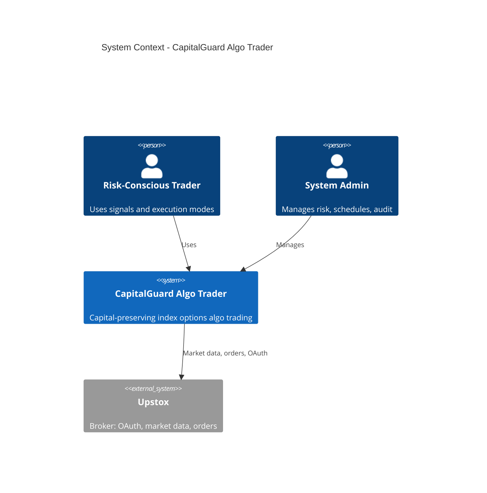
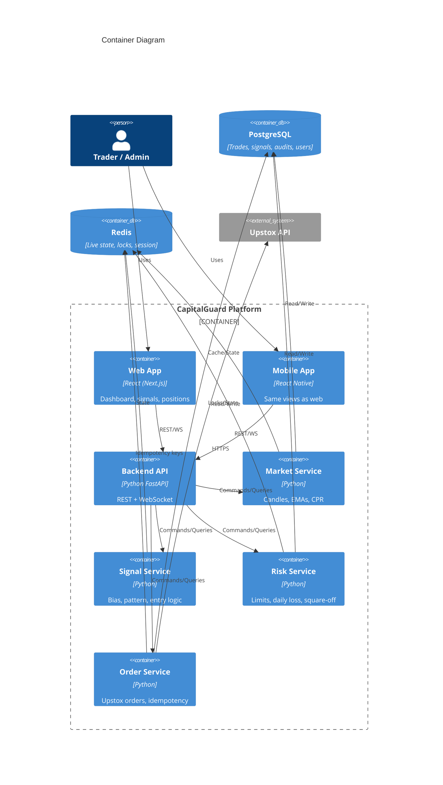
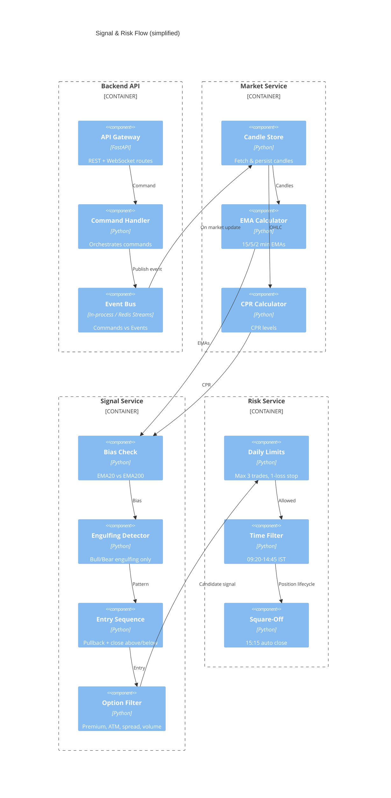
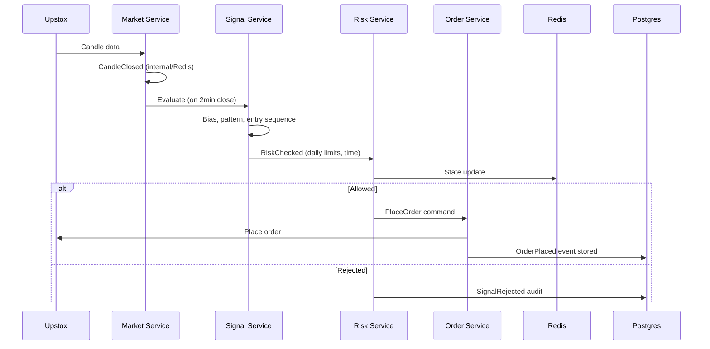

# Architecture: CapitalGuard Algo Trader

**C4 + Event Model | Event-Driven | Risk-First**

---

## 1. Context Diagram (C4 Level 1)



---

## 2. Container Diagram (C4 Level 2)



---

## 3. Component Diagram – Backend (Signal & Risk Flow)



---

## 4. Event Model

### 4.1 Command vs Event Separation

- **Commands**: intent (e.g. `EvaluateSignal`, `PlaceOrder`, `SwitchTradingMode`). Request–response where applicable.
- **Events**: facts that have happened (e.g. `CandleClosed`, `SignalGenerated`, `OrderPlaced`). Consumed by downstream services.

### 4.2 Core Event Schemas (canonical)

```yaml
# CandleClosed
CandleClosed:
  event_id: uuid
  timestamp: iso8601
  source: "market-service"
  payload:
    symbol: string  # NIFTY | SENSEX
    interval: string  # 15min | 5min | 2min
    open: float
    high: float
    low: float
    close: float
    volume: int
    candle_time: iso8601

# SignalGenerated
SignalGenerated:
  event_id: uuid
  timestamp: iso8601
  source: "signal-service"
  payload:
    signal_id: uuid
    symbol: string
    direction: "BUY" | "SELL"
    reason: string
    bias: string
    time_window_ok: bool
    risk_checklist: object  # pass/fail per rule
    option_instrument_key: string | null
    rejected_reason: string | null  # if rejected by risk

# RiskChecked
RiskChecked:
  event_id: uuid
  timestamp: iso8601
  source: "risk-service"
  payload:
    signal_id: uuid
    allowed: bool
    reason: string  # e.g. "daily_loss_stop" | "max_trades" | "time_window"
    daily_trade_count: int
    daily_loss_count: int

# OrderPlaced
OrderPlaced:
  event_id: uuid
  timestamp: iso8601
  source: "order-service"
  payload:
    order_id: uuid
    broker_order_id: string
    signal_id: uuid
    idempotency_key: string
    side: "BUY" | "SELL"
    instrument_key: string
    quantity: int
    order_type: string
    status: string

# TradingModeChanged
TradingModeChanged:
  event_id: uuid
  timestamp: iso8601
  source: "api"
  payload:
    user_id: uuid
    from_mode: "MANUAL" | "SEMI_AUTO" | "FULL_AUTO"
    to_mode: string
    consent_given: bool
    ip_address: string
```

### 4.3 Event Flow (High Level)



---

## 5. Service Responsibilities

| Service | Responsibility | Stores |
|---------|----------------|--------|
| **Market** | Fetch/store candles; compute 15/5/2 min EMAs and CPR; publish CandleClosed | Postgres (candles), Redis (latest EMAs/CPR) |
| **Signal** | Bias (EMA20 vs EMA200), time window, CPR filter, engulfing detection, entry sequence, option filter | Redis (last signal state) |
| **Risk** | Daily trade count, daily loss stop, time filter, square-off at 15:15, position limits | Postgres (trades), Redis (counters, locks) |
| **Order** | Upstox order API; idempotency; map signal → order; persist OrderPlaced | Postgres (orders), Redis (idempotency keys) |
| **API** | Auth, RBAC, WebSocket for live updates, mode switch with consent, audit log write | Postgres (audit), Redis (session) |

---

## 6. Idempotency & Replay

- **Order placement**: Every place-order command carries an `idempotency_key` (e.g. `signal_id` or `signal_id + intent`). Order service checks Redis/DB before calling Upstox; duplicate key → return existing order result.
- **Signal evaluation**: Keyed by `(symbol, interval, candle_time)`. Re-evaluation for same candle returns cached result from Redis to avoid duplicate signals.
- **Replay**: Events stored in Postgres (audit/signal/order tables). Replay for debugging or recovery is read-only; no duplicate orders due to idempotency keys.

---

## 7. Observability Strategy

- **Logging**: Structured JSON logs; correlation_id per request/flow; log level by environment.
- **Metrics**: Counters for signals generated/rejected, orders placed/failed, daily trades; gauges for open positions; latency histograms for strategy eval and order API.
- **Tracing**: Optional distributed trace (e.g. OpenTelemetry) from API → market → signal → risk → order.
- **Alerting**: Broker API failures, repeated order failures, daily loss stop triggered, square-off failures; on-call runbook for each.

---

*Document owner: Enterprise Solution Architect. Review: per major release.*
